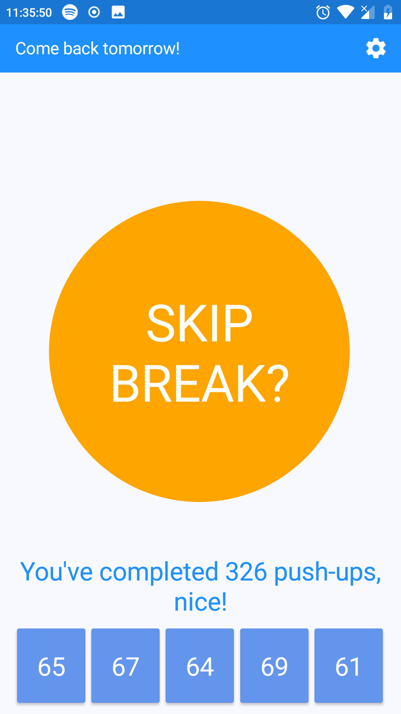

# PushUp App
I've created this application to increase my overall strength. It's a simple XAMARIN application with MVVM pattern made for Android phones.
User name and number of reptitions are saved locally so they don't disappear after closing the app. The day after completed workout user
gets a push notification to perform another one.

# Screenshots

